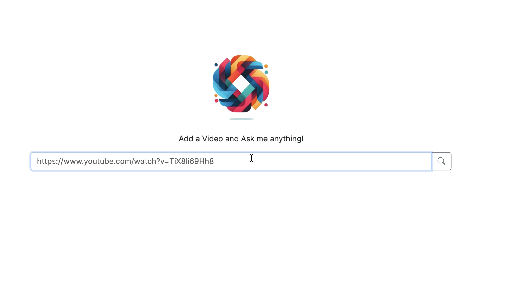
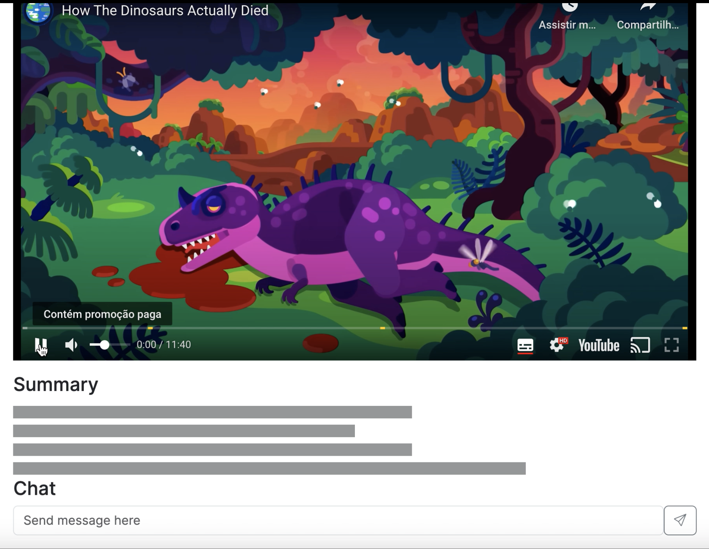
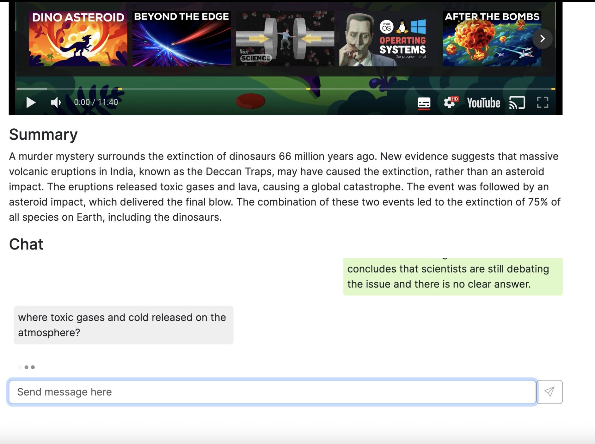

# AskYouTube

## Summary
AskYouTube is a project where the main scope is to summarize YouTube Videos and answer questions about the content of the video.

The project implements RAG Architecture with the ChromaDB Vector database to index text.

## Working Diagram

First we get the whole video transcription, then we transform the whole text into chunks, those chunks are transformed into embeddings and then we store it on the ChromaDB.

When a user asks a question we look for the top N documents related to that question and we add as context inside the prompt.

After that the LLM/Generative AI will generate an answer based on the text provided.

The project also counts with a simple caching system to process a video only once, after that the summary and the text embedding will never be done again. So when you search for a video that has been added to the application it will retrieve the summary instantly.

>Note: Known problems, Video Id's should not start with numbers or special characters such as '-' or '_'

## Project Demo

## How to use it

1. First add the video URL

2. Wait a couple of seconds

3. Get the Summary and ask questions about the video content

